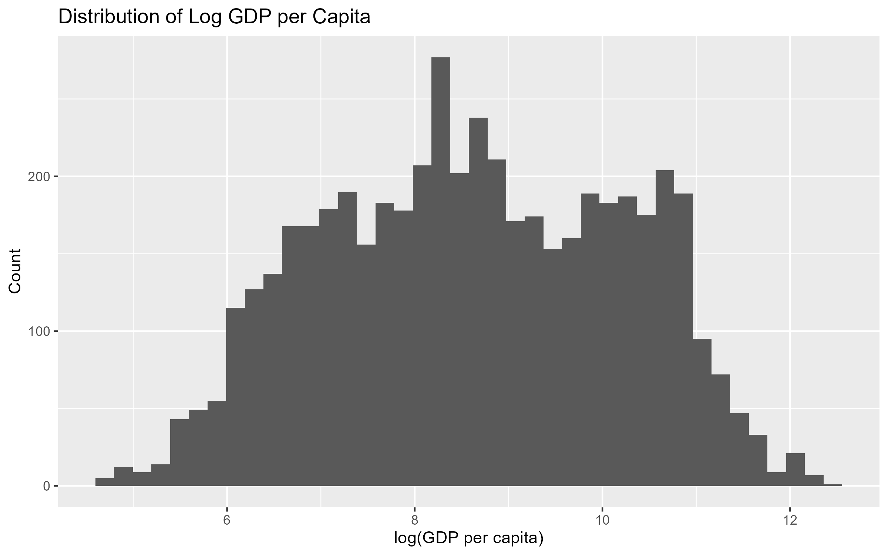
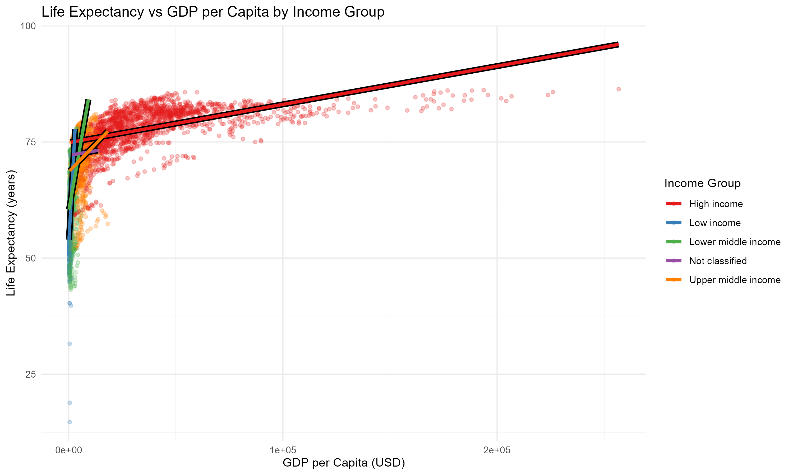
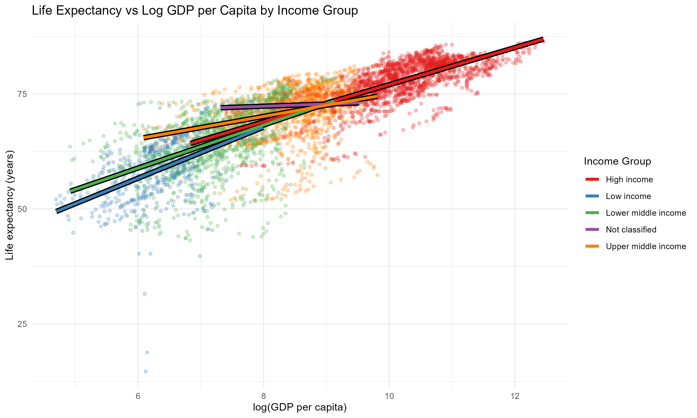
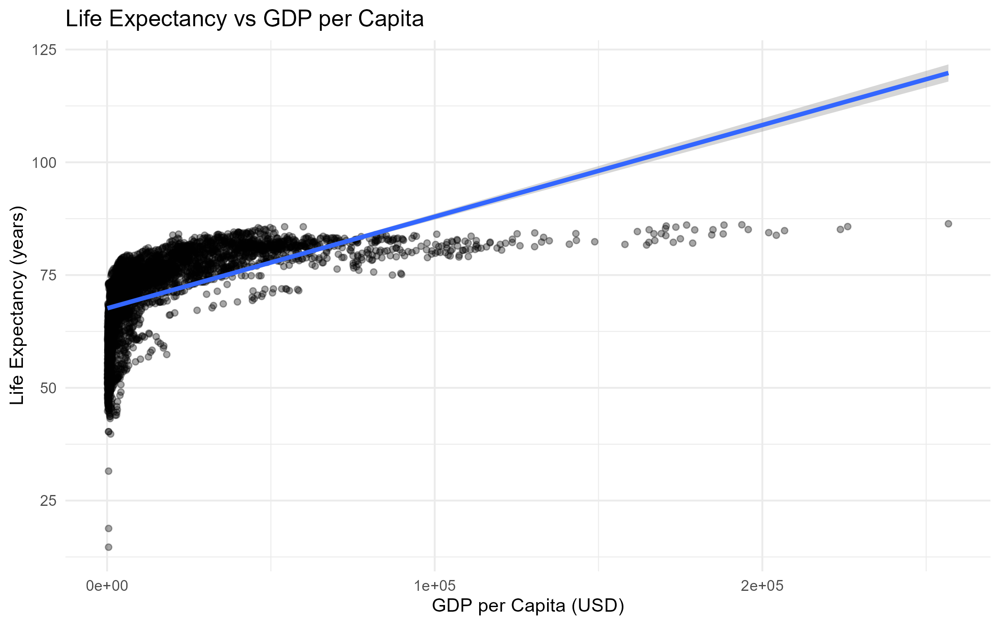
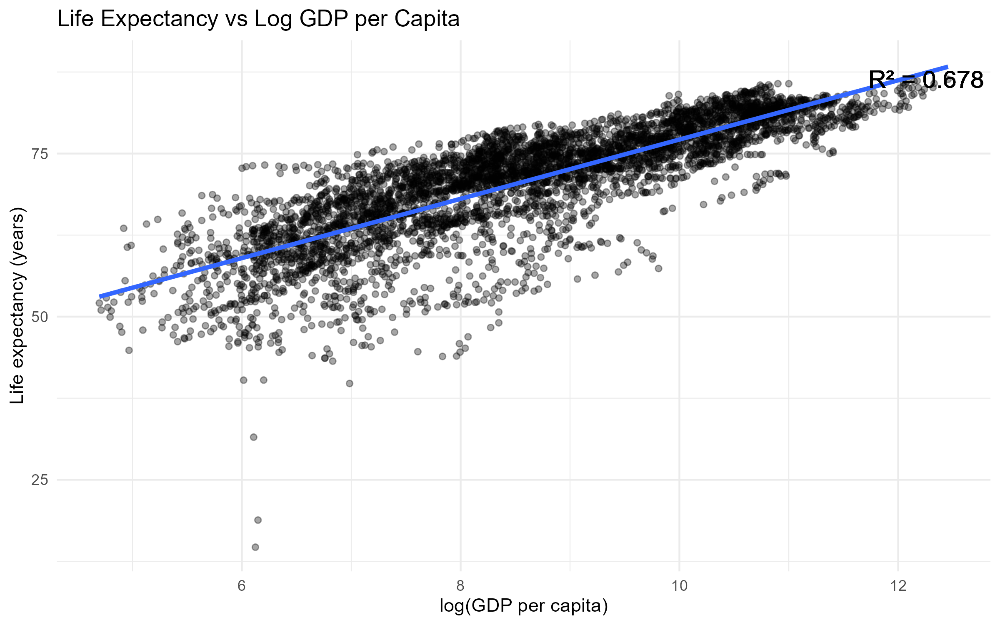
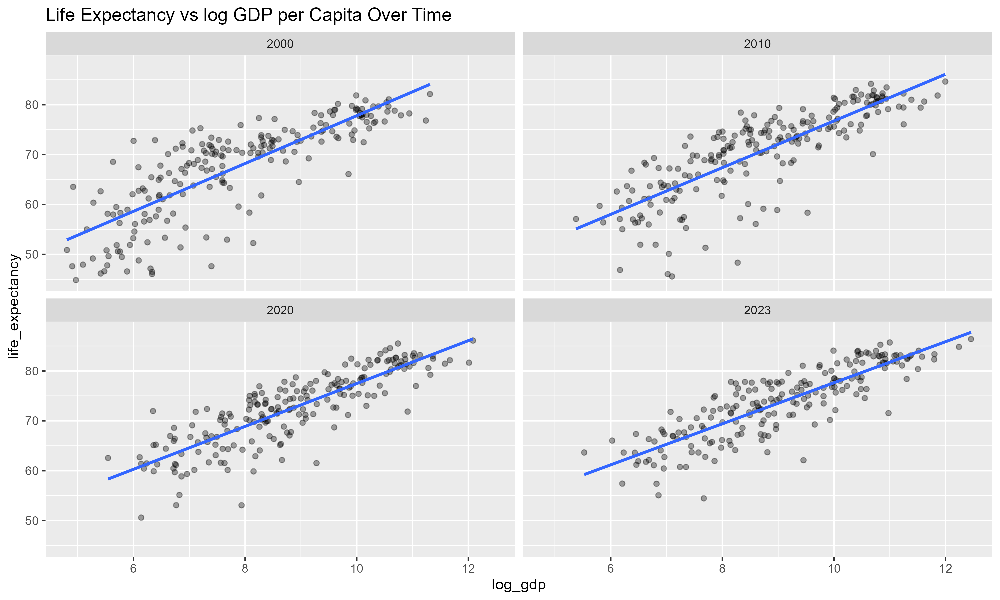

# GDP vs Life Expectancy Analysis

This project analyzes the relationship between GDP and life expectancy using R. It includes raw data, cleaned data, analysis scripts, and generated outputs.

This project uses publicly available World Bank economic and health datasets to analyze correlations between GDP per capita and life expectancy across countries.

---

## Skills Demonstrated

- Data cleaning
- Exploratory data analysis
- Statistical visualization
- R project organization
- Reproducible analysis workflow

---

## Repository Structure

- `data_raw/` — original datasets
- `data_clean/` — processed analysis-ready data
- `scripts/` — R scripts for cleaning and analysis
- `outputs/` — charts, tables, and final outputs

## Tools

- R
- RStudio
- ggplot2 / tidyverse

---

## Screenshots

### Histogram: Distribution of Log GDP per Capita

---

### Scatter Plot: Life Expectancy vs GDP per Capita by Income Group

---

### Scatter Plot: Life Expectancy vs Log GDP per Capita by Income Group

---

### Scatter Plot: Life Expectancy vs GDP per Capita

---

### Scatter Plot: Life Expectancy vs Log GDP per Capita

---

### Multi Scatter Plot: Life Expectancy vs Log GDP per Capita Over Time (2000, 2010, 2020, 2023)

---

## Data Source

The datasets used in this project were obtained from the World Bank Open Data platform.

### Sources

- GDP per capita data:
  https://data.worldbank.org/indicator/NY.GDP.PCAP.CD

- Life expectancy data:
  https://data.worldbank.org/indicator/SP.DYN.LE00.IN

The World Bank Open Data platform provides publicly accessible global development datasets covering economic, health, and demographic indicators across countries and years.

## Notes

- Data was exported from the World Bank datasets in CSV format.
- Additional cleaning and preprocessing were performed in R before analysis.
- Country/year alignment and missing value handling were completed during preprocessing.
